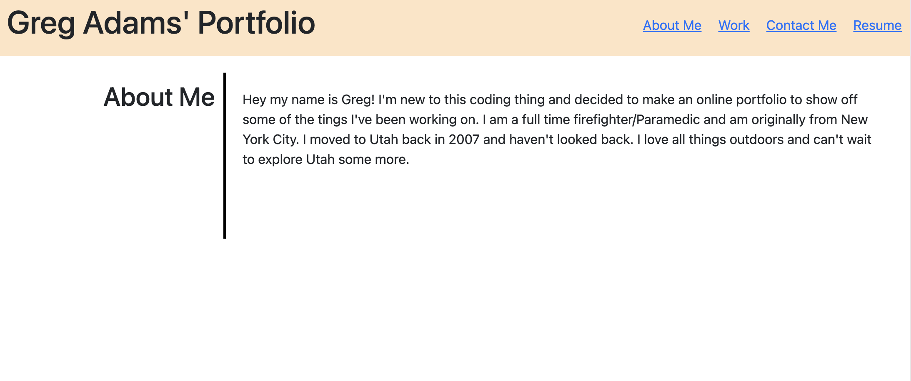

# REACT Portfolio

## Description
This personal portfolio was made with REACT and was amazing learning experience to showcase my work during my coding bootcamp.

## Screenshots

## Table of Contents
- [Installation](#installation)
- [Usage](#usage)
- [Licesnse](#license)
- [Contributing](#contributing)
- [Questions](#questions)

## Installation
you can acces my deployed link by clicking here: https://gregadamsportfolio.netlify.app

## Usage
You can use this by clicking through the navbar and following links to see my resume, work I've completedand to contact me.

## License
- Apache_2.0
- Link: https://opensource.org/license/apache-2-0/   

  

## Contributing
It was built by me.

## Questions
- Github username: gadams45
- Email address: gadams8340@gmail.com
      